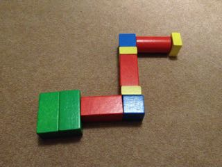

# ProgBlocks
gfdgfdgfdgdf
I have a two-year-old and a seven-year-old with learning difficulties. I want to introduce them to programming ideas, but it's way too early for a lot of things.

ProgBlocks is a modular physical programming system for robots. Imagine a set of building blocks that stick together in a chain, where each block is a command for a robot. Each block in the chain builds up a program that you can run by hitting a button on the start block.

The idea is that the system is robot-agnostic, and could be used to control any robot you like with a software interface (using something like [Artoo](http://artoo.io)).

## Block Types

*Start*: the main block, with batteries, raspberry pi, and connectivity built in. All hidden away, with a button on top to run the "program".

*Drive*: a block that makes the robot drive a set distance forward. We could have different sized blocks for different distances.

*Turn*: turn the robot through 90 degrees left or right. Could we make it detect which way up it is?

*Light*: Make the robot light up or glow a particular colour.

*Sound*: Make the robot make a noise of some sort.

We probably wouldn't have things like flow control blocks - the idea is to keep this simple enough for the very young.

## Hardware

(Imagine green is the *start* block, red is *drive*, blue is *turn*, and yellow is *light*)

The blocks are building-block sized, with a standard interface at each end. Blocks could be any length as long as they keep the interfaces the same. Blocks would stick together magnetically, and make electrical contacts for some sort of serial bus.

Each block would be addressable in some way along the serial bus (I2C?), and would simply respond with its command type and value. The raspberry pi would convert that into a set of commands to send to the robot via bluetooth, or whatever it was connected with. The electronics per block would be quite minimal.

Blocks on the serial bus would have to auto-address themselves in order of connection, so that the start block can run the program in the right order.

Blocks could be initially 3d printed for prototyping.

## Contributing

Pull requests, comments, and improvements, are greatly appreciated. I probably don't have time to build this for a good while, but if anyone wants to make it happen, go ahead. Get involved on the [GitHub repository](https://github.com/Floppy/progblocks).

## License

The idea is that this would be an Open Hardware project, with open source code. The idea is currently under a Creative Commons BY-SA 4.0 license.

 ProgBlocks by <a xmlns:cc="http://creativecommons.org/ns#" href="http://floppy.org.uk" property="cc:attributionName" rel="cc:attributionURL">James Smith</a> is licensed under a <a rel="license" href="http://creativecommons.org/licenses/by-sa/4.0/">Creative Commons Attribution-ShareAlike 4.0 International License</a>.
